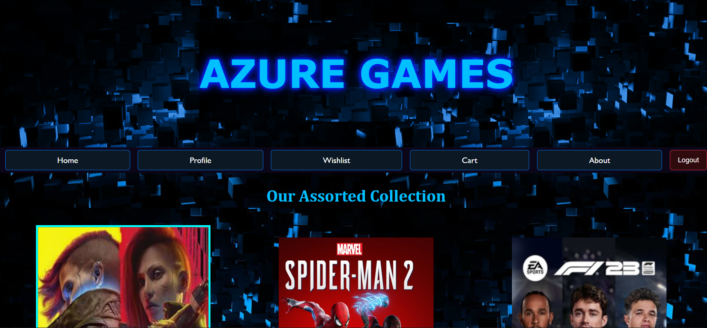

# Online Videogame Store - AZURE GAMES
Frontend for an online videogame store with multiple pages for various functionalities of an online platform for purchasing games.


## Table of Contents

- [Screenshots](#screenshots)
- [Features](#features)
- [Installation](#installation)


## Screenshots

### Home Page




## Features

- **Home Page:** Browse the latest and most popular games.
- **Profile Page:** View and edit your user profile, including stats and playtime.
- **Wishlist Page:** Manage your wishlist with options to move items to the cart.
- **Cart Page:** View and adjust items in your cart, and proceed to checkout.

## Installation

### Prerequisites

Ensure you have the following installed on your machine:

- [Node.js](https://nodejs.org/) (v14 or later)
- [npm](https://www.npmjs.com/) 

### Clone the Repository

```bash
git clone https://github.com/m-anshu/azure-games.git
cd azure-games


